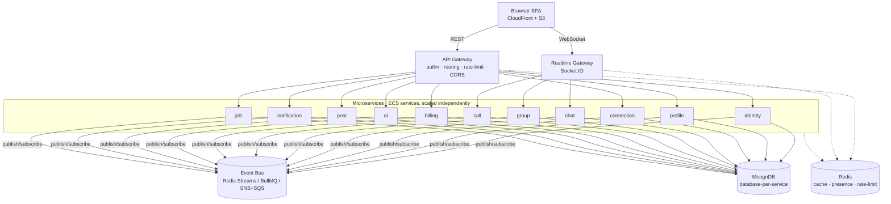
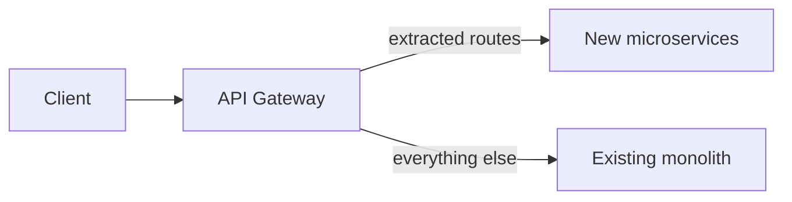

# Monolith → Microservices Migration Plan

**Status:** Proposed
**Owner:** vindreshsingh
**Last updated:** 2026-06-14
**Supersedes (in part):** the "we deliberately did not split into microservices" decision in [`phase10-scalability-rfc.md`](../specs/phase10-scalability-rfc.md)

---

## 0. TL;DR

We are migrating the `developer-connection` backend from a **modular monolith**
(one Express app, routers per domain, Socket.IO on the same HTTP server, single
MongoDB) to a set of **independently deployable microservices** behind an **API
gateway**, organized as a **monorepo** (`pnpm` + Turborepo).

We will do this incrementally using the **Strangler Fig** pattern: the gateway
sits in front of the existing monolith, and we peel services off one at a time.
Nothing is rewritten big-bang. The monolith keeps serving every route until a
replacement service is live and verified, then the gateway flips that route.

> **Read this first — honesty check.** The Phase 10 RFC made a deliberate,
> well-reasoned call *not* to do this. The domains are already cleanly separated,
> and microservices add real operational cost (network failure modes,
> distributed transactions, more infra, harder local dev). This plan documents
> the trade-offs so the decision is made with eyes open. If the driver is
> "scale" alone, the modular monolith + worker + Redis already scales
> horizontally. Microservices pay off mainly for **independent team ownership,
> independent deploy cadence, independent scaling/runtime per domain, and fault
> isolation**. Make sure that's the actual goal.

---

## 1. Goals & non-goals

### Goals
- Each domain is independently deployable, scalable, and ownable.
- Failure isolation: an outage in (say) `ai-service` must not take down auth.
- Clear contracts between services (versioned APIs + async events).
- No downtime during migration; every step is reversible.
- A monorepo that keeps shared code DRY while allowing per-service CI/CD.

### Non-goals
- Rewriting business logic. We **move** code, we don't rewrite it.
- Polyglot persistence for its own sake (we stay on MongoDB per service).
- Switching languages. Everything stays Node.js (ESM) + Express.
- Kubernetes (for now). We extend the existing **ECS Fargate** footprint.

---

## 2. Current state assessment

The backend is a Node.js (ESM) + Express 5 modular monolith:

- **Routers per domain** mounted in [`backend/src/app.js`](../../backend/src/app.js).
- **Socket.IO** on the same HTTP server ([`backend/src/sockets/index.js`](../../backend/src/sockets/index.js)).
- **One MongoDB** via Mongoose (all models in `backend/src/models/`).
- **Redis** for cache, distributed rate-limiting, Socket.IO pub/sub adapter,
  presence, and BullMQ queues.
- **A worker process** (`src/worker.js`) draining BullMQ queues.
- Deployed on **ECS Fargate behind an ALB**; SPA on **CloudFront + S3**
  (`infra/terraform/`).

This is the ideal starting point for decomposition — the seams already exist.

---

## 3. Service decomposition (bounded contexts)

Eleven business services + an API gateway + shared libraries. Mapping is derived
directly from the current routers ([`constants/apiEndpoints.js`](../../backend/src/constants/apiEndpoints.js))
and models.

| # | Service | Route prefix(es) | Owns (models) | Key existing code |
|---|---------|------------------|---------------|-------------------|
| 1 | **identity-service** | `/auth`, `/auth/oauth` | `user` (auth fields), credentials, tokens | `routes/auth.js`, `routes/oauth.js`, `middlewares/passport.js`, `services/oauthService.js` |
| 2 | **profile-service** | `/profile` | `user` (profile/projection), enrichment | `routes/profile.js`, `GitHubEnrichmentService`, `LinkedInEnrichmentService` |
| 3 | **connection-service** | `/request` | `connectionRequest`, `report`, blocking | `routes/connection.js`, `utils/blocking.js` |
| 4 | **chat-service** | `/chat` + chat sockets | `conversation`, `message` | `routes/chat.js`, `sockets/chatHandlers.js`, `presenceService` |
| 5 | **group-service** | `/groups` + group sockets | `group`, `groupMessage` | `routes/groups.js`, `sockets/groupChatHandlers.js` |
| 6 | **call-service** | `/calls` + call sockets | `callSession` | `routes/calls.js`, `sockets/callHandlers.js`, `LiveKitService` |
| 7 | **billing-service** | `/billing` | `subscription`, `plan`, `paymentEvent` | `routes/billing.js`, `PaymentService`, `BillingEventHandler` |
| 8 | **ai-service** | `/ai` | `aiUsageLog`, `resumeFeedback`, `interviewSession`, `recommendationCache` | `routes/ai.js`, `AIService`, `RecommendationService` |
| 9 | **post-service** | `/posts` | `post`, `postComment` | `routes/posts.js` |
| 10 | **notification-service** | `/notifications` | `notification` | `routes/notifications.js`, `utils/notifications.js` |
| 11 | **job-service** | `/jobs` | `jobPosting`, `jobApplication` | `routes/jobs.js` |
| — | **api-gateway** | `*` | none (routing, authn, rate-limit, CORS, WS upgrade) | new |
| — | **realtime-gateway** *(optional)* | WebSocket | none (Socket.IO front door) | extracted from `sockets/` |

### 3.1 The shared `User` problem (most important design decision)

`user` is touched by both **identity** (email, password hash, tokenVersion,
OAuth links) and **profile** (bio, skills, photos, enrichment). Splitting it is
the hardest part. Recommended approach:

- **identity-service is the system of record for the account** (`_id`, email,
  auth, status). It issues a stable `userId`.
- **profile-service owns the profile projection** keyed by the same `userId`
  (1:1). It treats `userId` as a foreign key, not an embedded document.
- Other services store **only `userId`** and fetch display data (name, photo)
  from profile-service via API, cached aggressively, or via a denormalized
  read model fed by `profile.updated` events.
- **Never share the Mongo collection across services.** Each service gets its
  own database/connection string (database-per-service).

---

## 4. Target architecture



### 4.1 Inter-service communication
- **Synchronous (request/response):** REST over HTTP for read-time lookups that
  need an immediate answer (e.g. gateway → identity for token validation,
  connection-service → profile for display data). Keep these shallow; deep call
  chains reintroduce monolith coupling with worse failure modes.
- **Asynchronous (events):** the default for anything that can be eventually
  consistent. Examples: `user.registered`, `connection.accepted`,
  `post.created`, `payment.succeeded` → notification-service fans out.
- **Event bus options (pick one):**
  - **Redis Streams / BullMQ** — reuse what you already run (lowest new infra).
  - **AWS SNS + SQS** — managed, durable, fits the ECS/AWS footprint (recommended for prod).
  - **Kafka** — overkill at current scale; revisit only if event volume explodes.

### 4.2 Authentication across services
- Today: JWT in an httpOnly cookie, verified by `middlewares/auth.js`.
- Target: the **gateway verifies the JWT once**, then forwards the request to
  the downstream service with a trusted, signed internal header (e.g.
  `x-user-id`, `x-user-roles`) over the private network. Downstream services
  trust the gateway (network-isolated) and do **not** re-validate the cookie.
- identity-service remains the only issuer/refresher of tokens and the only
  holder of the signing secret + `tokenVersion` revocation list.

### 4.3 Realtime (Socket.IO) strategy
- Socket.IO currently shares the HTTP server and reuses cookie auth.
- Target: a **realtime-gateway** owns WebSocket connections, authenticates the
  handshake, joins `user:<id>` rooms, and relays domain events. Chat/group/call
  services publish to the bus; the realtime-gateway (subscribed via the Redis
  adapter) pushes to the right rooms. This keeps the Redis pub/sub fan-out you
  already built and avoids every service speaking WebSocket.

---

## 5. Repository strategy — monorepo

A single private repo, `pnpm` workspaces + **Turborepo** for task orchestration
and caching.

```
developer-connection-microservices/
├── pnpm-workspace.yaml
├── turbo.json
├── package.json                 # root scripts (build/test/lint/dev across all)
├── docker-compose.yml           # local: all services + redis + mongo + bus
├── .github/workflows/           # per-service CI with path filters
├── gateway/
│   └── api-gateway/
├── services/
│   ├── identity-service/
│   ├── profile-service/
│   ├── connection-service/
│   ├── chat-service/
│   ├── group-service/
│   ├── call-service/
│   ├── billing-service/
│   ├── ai-service/
│   ├── post-service/
│   ├── notification-service/
│   └── job-service/
├── packages/                    # shared, versioned internally
│   ├── config/                  # env loading, constants
│   ├── logger/                  # pino wrapper (from utils/logger.js)
│   ├── errors/                  # error classes + handler (from middlewares/errorHandler.js)
│   ├── auth/                    # JWT verify, internal-header helpers
│   ├── events/                  # event bus client + event name constants
│   └── mongo/                   # connection helper (from config/database.js)
└── infra/
    └── terraform/               # one ECS service module per microservice
```

Each `services/*` package is a self-contained Express app: `package.json`,
`Dockerfile`, `src/index.js`, `src/routes/`, `src/models/`, `src/events/`,
tests, and a README declaring its owned routes, models, and published/consumed
events.

**Why monorepo (vs multi-repo):** shared packages stay in sync without
publishing to a registry, atomic cross-service refactors, one place for CI;
Turborepo's path-based caching means each service still builds/tests/deploys
independently. You can graduate any service to its own repo later.

---

## 6. Data strategy (database-per-service)

No monolith data migration is required — each service starts with a **fresh
database**. New users are created in identity-service (`identity` DB /
`accounts` collection); profile-service receives a bootstrap call and stores
profile fields in its own `profile` DB (`profiles` collection, same `_id` as
the account).

1. **One database per service** from day one (`identity`, `profile`,
   `connection`, …). `docker-compose.yml` and each service `.env.example`
   set `MONGO_URI` accordingly.
2. **Cross-service reads** use internal HTTP APIs protected by
   `INTERNAL_SERVICE_TOKEN` (not exposed through the public gateway). Event
   bus (`@dc/events`) can replace these calls later where async is fine.
3. **No dual-write / backfill** from the monolith — the Strangler Fig cutover
   means new traffic uses microservices; legacy monolith data can be archived
   separately if needed.
4. **No distributed transactions.** Use sagas / outbox for multi-service
   workflows (billing → notification, etc.).

---

## 7. Migration approach — Strangler Fig



1. Stand up the **API gateway** in front of the unchanged monolith. The gateway
   proxies 100% of traffic to the monolith. **Zero behavior change.** Ship it,
   verify, monitor.
2. Extract one service. Deploy it. Point its routes at the new service in the
   gateway. Keep the monolith's copy as a hot fallback (feature-flag the route).
3. Verify (traffic mirroring / canary), then delete the route from the monolith.
4. Repeat per service in the order below. The monolith shrinks each step until
   only shared scaffolding remains, then it's retired.

### Recommended extraction order (low risk → high coupling)
1. **notification-service** — mostly event consumer, few inbound deps. Great pipe-cleaner.
2. **ai-service** — self-contained, async-friendly, isolates the slow/expensive Anthropic calls.
3. **job-service** — clean bounded context, low coupling.
4. **post-service** — depends on profile for display data (via events).
5. **billing-service** — sensitive; isolate the Razorpay webhook + secrets early.
6. **connection-service** — depends on profile + emits events to notification/chat.
7. **group-service** then **call-service** — share realtime; do alongside realtime-gateway.
8. **chat-service** — realtime + presence; highest coordination.
9. **profile-service** then **identity-service** — the `user` split is last and hardest; everything depends on them, so move them only once contracts are proven.

---

## 8. CI/CD & infrastructure

- **CI (GitHub Actions):** per-service workflows triggered by path filters
  (`services/identity-service/**`) so only changed services build/test. Turbo
  remote cache speeds repeated builds. Shared-package changes fan out to dependents.
- **Images:** one ECR repo per service; image tag = git SHA.
- **Deploy:** extend `infra/terraform/` — a reusable ECS-service module
  instantiated per microservice (task def, service, target group, autoscaling,
  log group, secrets). The gateway gets the ALB listener; services sit behind it
  on the private network.
- **Secrets:** per-service Secrets Manager entries (billing's Razorpay keys,
  ai's Anthropic key, etc.) — least privilege per task role.
- **Networking hardening (do this as part of the split):** move ECS tasks +
  ElastiCache into **private subnets** with a NAT gateway; only the ALB is public.

---

## 9. Observability (non-negotiable for microservices)

- **Distributed tracing:** OpenTelemetry SDK in every service + the gateway;
  propagate trace context across HTTP + events. Export to your APM (you already
  use Sentry — add tracing).
- **Structured logs:** keep `pino`; include `traceId` + `service` on every line;
  ship to CloudWatch (already configured) or a log aggregator.
- **Metrics + health:** keep `/health` per service; add readiness vs liveness;
  RED metrics (Rate, Errors, Duration) per service; ECS + ALB target-group alarms.
- **Queue/bus depth dashboards** (Bull Board or SQS metrics).

---

## 10. Phased roadmap

| Phase | Outcome | Exit criteria |
|-------|---------|---------------|
| **M0 — Foundations** | Monorepo created; shared `packages/*` extracted; CI green; local `docker-compose` runs monolith + redis + mongo. | `pnpm install && pnpm build && pnpm test` pass in CI. |
| **M1 — Gateway** ✅ | API gateway proxies 100% to the monolith; auth verified at edge. | Prod traffic through gateway, error rate flat, p95 latency within +5%. |
| **M2 — First service (notification)** ✅ | notification-service live; gateway routes `/notifications`; events flowing on the bus. | Parity tests pass; monolith route removed. |
| **M3 — Async-friendly services** ✅ *(shared-DB phase)* | ai, job, post extracted; gateway routes `/ai`, `/jobs`, `/posts`; shared `@dc/redis`, `@dc/cache`, `@dc/cloudinary` packages added; user-doc auth re-checks `tokenVersion` (gateway forwards it). Still pending per service: monolith route removal, event-driven notification writes, own database. | Each: parity + canary + monolith route removed. |
| **M4 — Sensitive + coupled** ✅ *(shared-DB phase)* | billing + connection extracted; gateway routes `/billing`, `/request`; shared `@dc/ratelimiter` added; Razorpay webhook raw-body integrity preserved end-to-end through the gateway; idempotent webhook consumer (PaymentEvent dedupe). Still pending: monolith route removal, durable outbox + published `billing.*`/`connection.*` events, and removing cross-context writes (`users.isPremium`, `users.blockedUsers`). | Webhook + payment flows verified end-to-end. |
| **M5 — Realtime** ✅ *(shared-DB phase)* | realtime-gateway (Socket.IO front door: auth, presence, chat/group/call handlers) + chat, group, call REST services extracted; gateway routes `/chat`, `/groups`, `/calls` and proxies the `/socket.io` HTTP handshake **and** WebSocket upgrade to the realtime-gateway (monolith catch-all `ws` disabled so upgrades don't leak); new `@dc/realtime` package lets REST services push events into gateway rooms via `@socket.io/redis-emitter` (cross-instance fan-out + cluster-wide presence need `REDIS_URL`). Still pending: monolith socket/route removal at cutover, and removing cross-context model reads/writes (chat/call read `users`/`connectionrequests`/`groups`/`plans`; call writes `call_summary` into chat's `messages`/`groupmessages`). | WebSocket parity (presence, messaging, calls) under load. |
| **M6 — The core split** ✅ | identity + profile on separate DBs; `@dc/service-clients` for cross-service calls; monolith stripped to `/health` shell; all services use remote auth via identity/profile APIs; billing writes `isPremium` through profile-service. | Gateway is the sole entry point; monolith decommissioned when ops confirms zero fallthrough traffic. |
| **M7 — Hardening** | Autoscaling per service, private subnets, tracing, runbooks. | SLOs defined and met; on-call runbooks exist. |

---

## 11. Risks & mitigations

| Risk | Impact | Mitigation |
|------|--------|------------|
| Distributed complexity > benefit | Slower delivery, more outages | Strangler fig; stop if value isn't there — the monolith is a valid end state. |
| The `user` split | Data integrity bugs | Do it last; dual-write + backfill + verify; identity is sole account SoR. |
| Chatty sync calls recreate a "distributed monolith" | Latency, cascading failure | Prefer events; cache cross-service reads; circuit breakers + timeouts. |
| Eventual-consistency bugs | User-visible staleness | Idempotent consumers; outbox pattern; reconciliation jobs. |
| Local dev friction | Slower iteration | `docker-compose` for the full stack; Turbo for fast partial builds. |
| Secret sprawl | Security | Per-service Secrets Manager + least-privilege task roles. |
| Cost increase (more tasks/DBs) | $$ | Right-size tasks; scale-to-low; start with shared Mongo, split DBs only when needed. |

---

## 12. Rollback strategy

Every step is reversible because the monolith stays alive until a service is
proven:
- **Per route:** gateway route flag flips back to the monolith instantly.
- **Per service:** redeploy previous task definition (ECS keeps revisions).
- **Data:** dual-write windows mean old collections stay authoritative until cutover.

---

## 13. Appendix — per-service contract template

Each service's README must declare:
- **Owned routes** (copied from `constants/apiEndpoints.js`).
- **Owned models / collections.**
- **Published events** (name, payload schema, when).
- **Consumed events.**
- **Synchronous dependencies** (which services it calls, with timeouts/fallbacks).
- **Secrets/env** required.
- **SLO** (availability + latency target).

---

## 14. Immediate next steps

1. Create the private monorepo `developer-connection-microservices`.
2. Scaffold workspace + shared packages + 11 service skeletons + gateway.
3. Wire CI (path-filtered) and `docker-compose` for local dev.
4. Implement **M1 (gateway in front of the monolith)** first — highest safety,
   immediate value, unblocks everything else.
