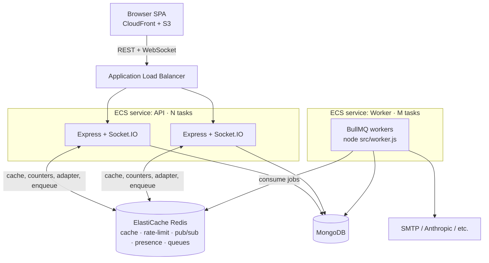

# Phase 10 — Scalability: caching, distributed state & event-driven jobs

**Status:** Implemented
**Scope:** Redis (cache + distributed state + pub/sub), a BullMQ event queue
with a dedicated worker service, and the Terraform/CD to run them on AWS.

## 1. Motivation

The backend is a well-structured **modular monolith** (one Express app, routers
per domain, Socket.IO on the same HTTP server) deployed on **ECS Fargate behind
an Application Load Balancer** (the load balancer asked for already exists —
`infra/terraform/alb.tf`). Three real gaps blocked horizontal scaling:

1. **No shared cache.** The only cache (`recommendationCache`) lived in Mongo;
   every read still hit the database.
2. **In-memory state breaks at >1 task.** Rate-limit counters
   (`express-rate-limit`) and the Socket.IO presence registry
   (`presenceService`) were per-process. Behind the ALB with 2+ tasks this is a
   *correctness* bug: limits multiply by task count, and socket/presence events
   only reach users who happen to land on the same task as the sender.
3. **Heavy work runs in the request path.** Transactional emails (and, by
   extension, any future AI/notification fan-out) were sent synchronously,
   coupling request latency and reliability to a third party.

We deliberately did **not** split into microservices — the domains are already
cleanly separated and the operational cost isn't justified for this project. We
added the patterns that give real scaling headroom at low cost.

## 2. Design principle: graceful degradation

Redis is **optional**. Everything keys off `REDIS_URL`:

| Concern            | `REDIS_URL` set (prod, ≥1 task) | `REDIS_URL` unset (local / CI) |
|--------------------|----------------------------------|--------------------------------|
| Caching            | Redis read-through               | no-op (always a miss)          |
| Rate limiting      | shared `rate-limit-redis` store  | in-memory store                |
| Socket.IO fan-out  | Redis pub/sub adapter            | single-instance                |
| Presence registry  | Redis socket-count set           | in-memory `Map`                |
| Jobs (email, …)    | enqueued → worker process        | run **inline** (awaited)       |

This keeps the app a zero-infra monolith for local dev and keeps the existing
Jest suite (no Redis) green, while production gets correct distributed behavior.

## 3. Target topology

- **API tasks** stay stateless → the ECS service can scale out / in freely.
- **Worker tasks** scale independently of request traffic.
- **Redis** is the one new stateful dependency, doing five jobs at once.

## 4. What was built

### 4.1 Redis foundation
- `backend/src/config/redis.js` — `ioredis` singleton + `createRedisClient()`
  factory (BullMQ needs `maxRetriesPerRequest: null`). Returns `null` when
  disabled; exposes `isRedisEnabled`.
- `docker-compose.yml` — local Redis 7 for `REDIS_URL=redis://localhost:6379`.

### 4.2 Caching — `backend/src/utils/cache.js`
- `get / set / del / remember` (JSON, TTL). Errors are treated as a miss —
  caching never fails a request.
- Applied to:
  - `GET /ai/recommendations` — Redis tier in front of the durable Mongo
    `recommendationCache`, invalidated on dismiss.
  - `GET /jobs` — short-TTL (30 s) per-user listing cache.

### 4.3 Distributed state
- `middlewares/rateLimiter.js` — `rate-limit-redis` store (per-limiter key
  prefix) when Redis is on.
- `sockets/index.js` — `@socket.io/redis-adapter` so room emits cross tasks.
- `sockets/presenceService.js` — online/offline transitions computed from a
  Redis socket-count set (`presence:user:<id>`); broadcasts go to the
  recipient's `user:<id>` room (fanned out by the adapter).

### 4.4 Event-driven jobs (BullMQ)
- `queues/names.js` — queue-name constants.
- `queues/index.js` — `enqueue(queue, data, opts)`: BullMQ `add` when Redis is
  on, else inline handler execution. Retries with exponential backoff.
- `jobs/handlers.js` — the single definition of each job's work (currently the
  `email` queue → `utils/email.js`).
- `worker.js` — separate entrypoint (`npm run worker`) running a BullMQ
  `Worker` per queue; drains in-flight jobs on `SIGTERM`.
- Producers wired: verification + password-reset emails (`routes/auth.js`).

### 4.5 Infra & CD
- `infra/terraform/elasticache.tf` — Redis replication group, subnet group, and
  a security group that only allows 6379 from the ECS task SG.
- `infra/terraform/ecs_worker.tf` — second ECS service running the **same
  image** with `command = ["node","src/worker.js"]`.
- `REDIS_URL` injected into both tasks from the ElastiCache endpoint (env, not a
  secret — it's known at apply time).
- `.github/workflows/deploy.yml` — rolls the worker on the same image tag as the
  backend.

## 5. Extending it

Adding a new async job is three steps: add a name to `queues/names.js`, a
handler to `jobs/handlers.js`, and `await enqueue(QUEUE.X, payload)` at the call
site. Good next candidates: AI recommendation regeneration (move the synchronous
Anthropic call off `GET /ai/recommendations`), notification fan-out, and
job-application emails to posters.

## 6. Hardening (future)
- Move ElastiCache + ECS tasks into **private subnets** with a NAT gateway.
- Enable Redis **AUTH + in-transit TLS** (`rediss://`) and ElastiCache
  Multi-AZ (`num_cache_clusters > 1`, `automatic_failover_enabled`).
- ECS **autoscaling** policies (target tracking on CPU / ALB request count for
  the API; queue depth for the worker).
- A BullMQ **dashboard** (e.g. Bull Board) behind auth for queue observability.
